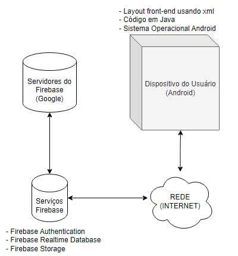
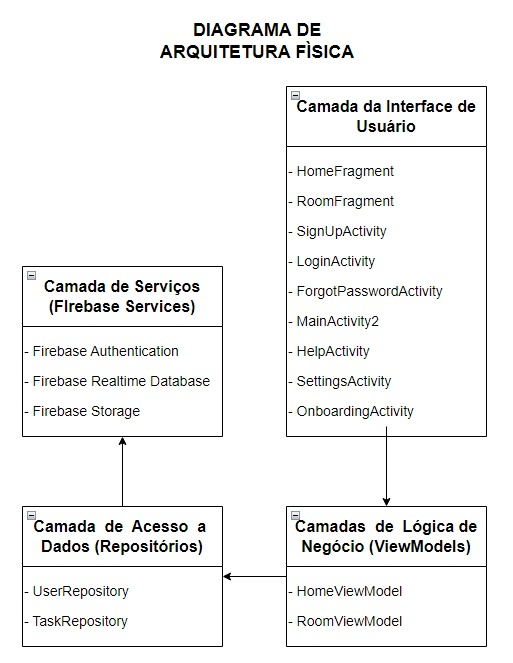

# Projeto - Tarefas domésticas
#### Projeto destinado à criação de um aplicativo destinado à criação, gerência e atribuição de tarefas domésticas à usuários dentro de uma mesma residência/corporação, com a finalidade de organizar quais atividades dados usuários deverão realizar, notificando-os para que se lembrem de completá-las.

## Requisitos funcionais:
- CRUD usuários do aplicativo
- Adicionar Cômodos
- Adicionar tarefas
- Atrelar tarefas aos usuários (Conta Principal/ADMINS)
- Programar notificação de tarefa
- Consultar estado da tarefa
- Ver Tarefas

## Requisitos não-funcionais:
- Interface simples e direta
- Até (10) usuários por conta
- Android Studio
- Código em Java
- Código limpo e coeso, com comentários e manuteabilidade
- Carregamento não pode exceder 1 segundo
- SOMENTE o criador da conta e os usuários que ele colocar como admin podem alterar os dados/adicionar e atrelar tarefas
- Android 6.0+
- Vai custar um total de 0 reais pq o bagulho é pra trabalho
- Não pode haver falhas
- Armazenamento necessário: 12mb
- Classes: Usuário, Tarefa, Cômodo, Main

## Regras de negócio:
- Uma tarefa pode ser atribuída a vários usuários
- As tarefas devem ter prazo de vencimento definido
- Cada usuário pode ser definido como administrador ou membro
- Os usuários podem escolher receber notificação pelo e-mail ou pelo próprio aplicativo
- Os dados dos usuários devem ser protegidos e não podem ser compartilhados com terceiros sem consentimento
- Será mantido um registro do histórico de todas as atividades realizadas pelos usuários 

# Diagramas
#### Diagramas usados para realização do projeto
## Caso de Uso
</img>

## Arquitetura Lógica
</img>

## Arquitetura Física
</img>
